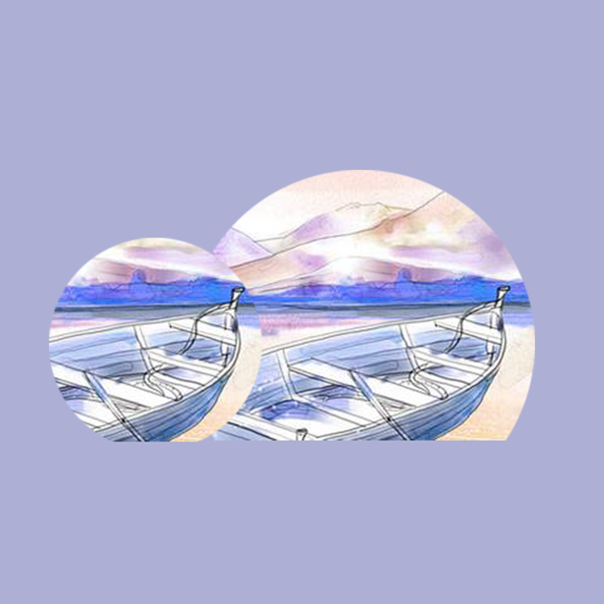

## 欢迎来到 我的划船练习记录工具

划船是一件非常有趣和健康的兴趣爱好，你可以和家人一起划着小船在绿水千山中滑行，也可以和朋友一起在湖中自由自在的泛着小舟。当然，划船也是有很多技巧需要练习的。你可以记录你计划划船练习的时间，实际练习的时间，滑行的距离和获得的心得体会和感受等。帮助你了解自己的划船练习情况，更好的提升自己，享受划船的快乐。

如果您遇到什么需要解答的问题，请发送您的问题到以下邮箱。

我们将第一时间为您解答。

### 邮箱地址: zhanghesongyuan7@126.com

谢谢！
